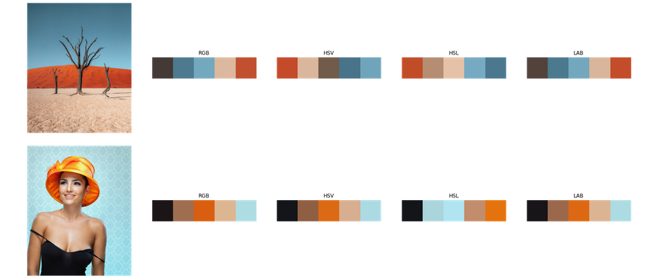

## Color Palette Detection in Multiple Spaces Using Python

In this project, I extract color palettes from different images using different color spaces namely: **RGB** (red,green,blue) , **HSV** (hue, saturation, value), **HSL** (hue, saturation,lightness) and **LAB** (CIELAB), . 

The extraction is performed using unsupervised machine learning algorithms, here we choose to apply k-means on colored pixels of the image.

Finally, I present a simple method to sort color palettes in order to have a sense of perceptual continuity.

